# T-Cast: Predicting MBTA Ridership Based on Weather Conditions

## Project Description

- Final Report Video: https://www.youtube.com/watch?v=wjziJXPK-m8
- Midterm Report Video: https://youtu.be/1qrfAWM0dHE?feature=shared

[Jump to Project Setup and Testing Instructions](#running-and-setting-up-the-project)

Using historical data publicly available from the MBTA website, our project predicts the number of people that use specific MBTA stations (measured by gate entries) based on weather conditions including temperature, precipitation, and wind speed.

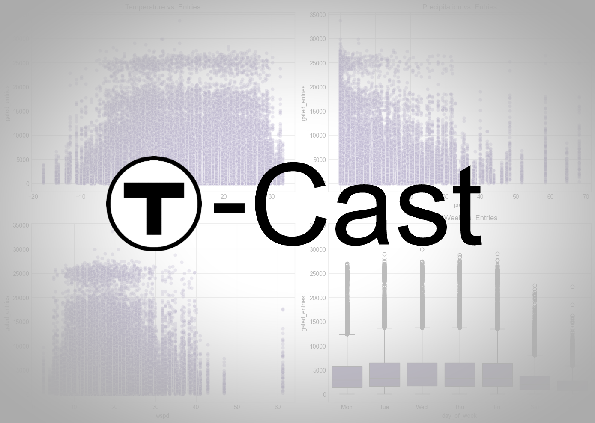

## Goals

The goal of this project is to successfully predict the number of gate entries into MBTA train stations based on weather conditions. This will help MBTA planners understand how weather affects day-to-day ridership to improve operational logistics, such as scheduling train arrivals/departures, staffing, and resource allocation.

## Notebook Overview

- initialModels.ipynb: Implements baseline and enhanced linear regression models to predict MBTA ridership from weather data, including COVID-period features and visualization of results.

- tuningModel.ipynb: Builds more sophisticated models including pipeline models with polynomial features and station-aware models, featuring improved feature engineering and cross-validation techniques.

- dataInsights.ipynb: Explores relationships between weather conditions (temperature, precipitation, wind speed) and ridership across stations using bar plots and general visualizations.

- dataInsightsLine.ipynb: Analyzes weather impacts on ridership specifically by MBTA line color, with stations organized in geographical order to reveal line-specific patterns.

## Data Collection

- **MBTA Ridership Data**: Daily gate entries for each MBTA train station from 2018-2023, sourced from MassGIS Data Hub.
- **Weather Data**: Daily weather conditions in Boston from 2018-2023, sourced from Kaggle dataset providing temperature, precipitation, and wind speed measurements.

## Data Processing

Our data processing pipeline includes several key steps:

### Initial Data Consolidation:

- Combined yearly MBTA data files into a single comprehensive dataset
- Processed raw weather data to align with MBTA data format

### Data Cleaning:

- Outlined the null values of the raw MBTA and weather datasets:
  - MBTA: There were many null values for the stop_id column, but since we are looking at gated entries by station, we can ignore it
  - Weather: wdir (wind direction) and pres (average sea-level air pressure): We don't believe these would significantly impact ridership levels
- Removed unnecessary columns (stop_id, route_or_line) from MBTA data
- Dropped wind direction (wdir) and pressure (pres) from weather data
- Handled missing values:
  - For the single missing temperature (tavg) value, imputed using the average of minimum and maximum temperature
  - No missing values were found in the critical columns (gated_entries, precipitation, wind speed)

### Data Transformation:

- Aggregated station entries by date and station name to get daily totals using groupby(['service_date', 'station_name'])
- Standardized date format between datasets using pd.to_datetime
- Added derived features:
  - Day of week (0=Monday to 6=Sunday)
  - Weekend indicator (1 for Saturday/Sunday, 0 otherwise)
  - Month and year variables
  - MBTA line color assignment based on station names

### Data Integration:

- Merged MBTA and weather datasets on service_date using pd.merge with inner join
- Limited dataset to dates where both weather and ridership data were available (Jan 2018 to March 2023)
- Final dataset includes: service_date, station_name, gated_entries, tavg, tmin, tmax, prcp, wspd, day_of_week, is_weekend, month, year, and line_color

## Data Modeling Methods

We implemented a progressive modeling approach to understand the relationship between weather conditions and MBTA ridership:

### Baseline Weather-Only Linear Regression:

- Features: Average temperature (tavg), precipitation (prcp), wind speed (wspd)
- Target: Daily gated entries
- Training Method: Time-based split (train on pre-2022, test on 2022-2023 data)
- Evaluation Metrics: MSE, RMSE, MAE, and R² score
- Results: Weather variables alone provided limited predictive power (negative R² scores for line-specific models)

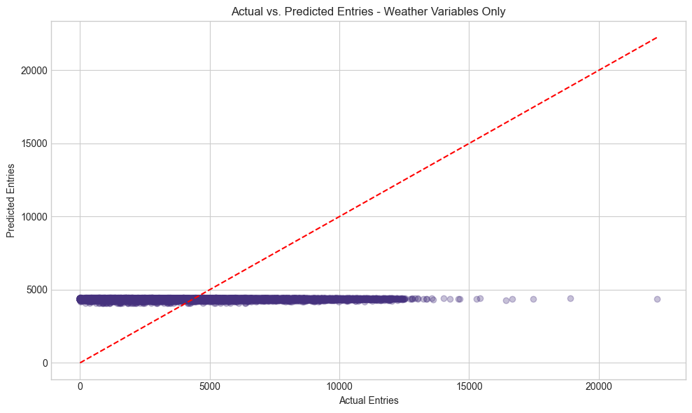

### Enhanced Linear Regression Model w/ Temporal & Categorical Features:

- Added temporal features: Day of week, month, and weekend indicator
- Added categorical features: Line color
- Significant improvement in predictive accuracy over baseline model
- Model confirmed that temporal patterns are stronger predictors than weather variables

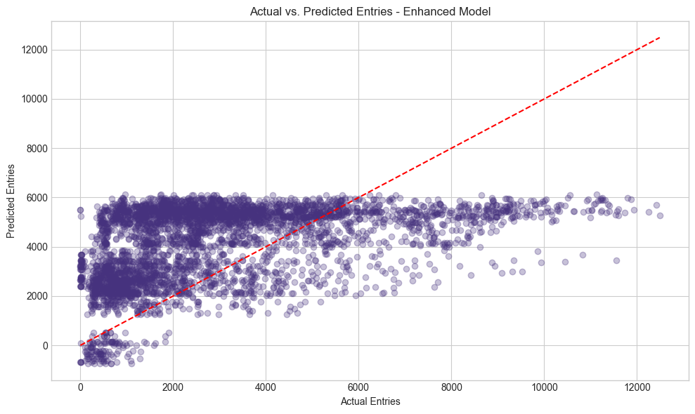

### Line-Specific Analysis:

- Built separate models for each MBTA line (Red, Green, Orange, Blue, Silver)
- Found varying weather sensitivity across different lines
- Green Line showed highest weather sensitivity, possibly due to its above-ground segments
- Line-specific models revealed unique patterns in how different parts of the system respond to weather

### Enhanced Linear Regression Model w/ Even More Features:

- Season Feature
  - Looks at which season the date is in (fall, winter, spring, or summer)
- US Holiday Feature
  - Looks at whether the date lands on a US holiday
  - Looks at how many days away a previous/following holiday is, because holiday seasons can affect ridership
- Week Start Feature
  - Computes the Monday date of that week
  - Helps aggregate daily ridership within a weekly bucket
- Lagging Feature
  - Helps predict current day's number of gate entries by using the day before's number of entries
- Rolling Feature
  - Computes average ridership over past 7 days to smooth noise & capture small trends in ridership
- Cyclical Month Feature
  - Allows for smooth transition between months (i.e. December to January)
- COVID Features
  - COVID-19 Pandemic caused significant decrease in ridership --> features for initial shutdown period and following recovery periods account for that
  - Weekends during COVID periods decreased even more than weekday since people were not going out for leisure as much; account for that with is_covid_weekend and is_recovery_weekend
- Features with the largest coefficient magnitude were: is_covid_period, is_recovery_period, is_weekend, covid_weekend, is_post_covid
  - Shows that these new added features affect the model significantly, but also that this model requires more tweaking

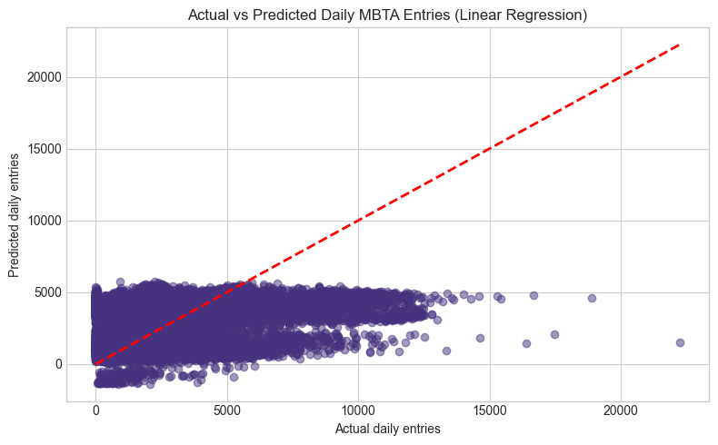

### Pipeline Model

- Used the same features as second Enhanced LinReg Model
- Pipeline Model
  - PolynomialFeatures
    - Allows model to learn non‐linear and interaction effects (e.g. lag1 × roll7).
  - StandardScaler
    - Ensures that each feature is on a comparable scale
  - RidgeCV
    - Fits linear model with L2 regularization & uses time‐series cross‐validation to pick the best alpha

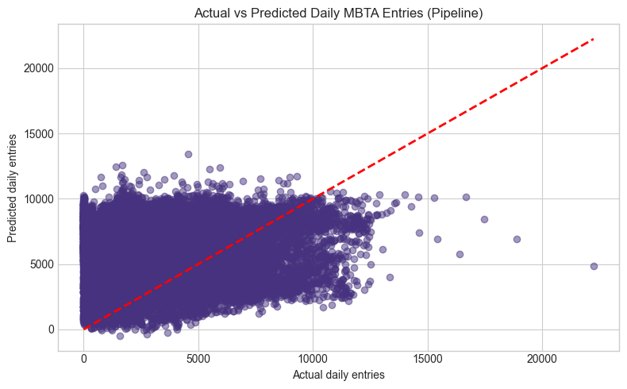

### Station-aware Pipeline Model

- One-hot encode stations
  - Creates one dummy column per station so the model can learn a separate intercept shift for each
  - Added these station dummies to the existing X_cols feature columns
- Same pipeline as previous Pipeline model
  - PolynomialFeatures
    - Allows model to learn non‐linear and interaction effects (e.g. lag1 × roll7).
  - StandardScaler
    - Ensures that each feature is on a comparable scale
  - RidgeCV
    - Fit linear model with L2 regularization & uses time‐series cross‐validation to pick the best alpha

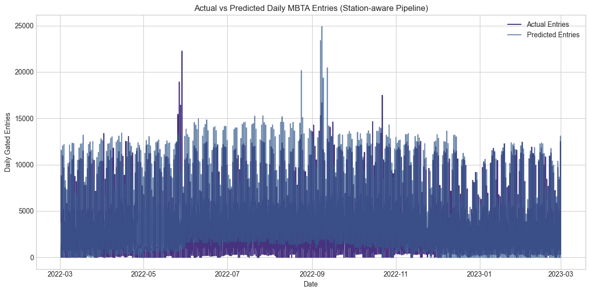
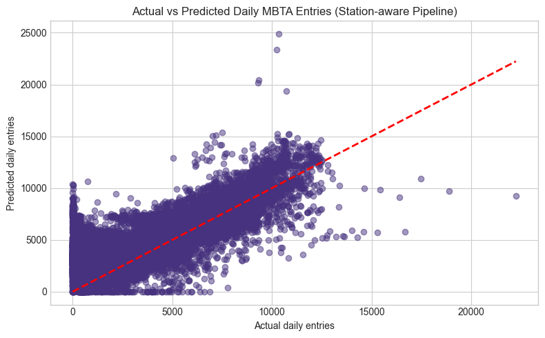

## Key Insights

### Weather Impact Patterns

#### Temperature Effects:

- Generally positive correlation with ridership
- Different impacts across lines (Green Line most sensitive)
- Some recreational-area stations show stronger positive correlation with warm temperatures

#### Precipitation Patterns:

- Non-linear relationship with ridership
- Light to moderate rain (0-30mm) shows minimal impact
- Heavy rain (40mm) leads to decreased ridership
- Extreme precipitation (60mm+) shows ridership increase, suggesting people avoid driving

#### Wind Speed Influence:

- Similar pattern to precipitation
- Mild winds show little effect
- Strong winds (40+ WSPD) decrease ridership
- Extreme winds (60+ WSPD) increase public transit use as alternatives become unsafe

#### Temporal Factors:

- Day of week is the strongest predictor (weekdays vs weekends)
- Weekday patterns show higher, more consistent ridership
- Weekend ridership significantly lower across all stations
- These temporal patterns outweigh weather effects in importance

### Line-Specific Findings

#### Red Line:

- Temperature has a moderate positive effect (3.82 more entries per °F)
- Precipitation shows the expected negative effect
- Wind speed oddly shows a slight positive effect
- Model suggests ridership is moderately affected by weather

#### Green Line:

- Temperature has the strongest positive effect among all lines (12.60 entries per °F)
- Precipitation shows a stronger negative effect compared to other lines
- Wind speed shows the expected negative effect
- Most weather-sensitive line, likely due to above-ground segments

#### Orange Line:

- Temperature shows a counterintuitive negative effect
- Precipitation shows minimal negative effect
- Wind speed shows an unexpected positive effect
- Least weather-sensitive among major lines

#### Silver Line:

- Shows unique and sometimes counterintuitive weather relationships
- Precipitation oddly shows a positive coefficient
- Suggests different ridership patterns than traditional rail lines
  - Possibility due to limited data of the silver line, as it is mostly a shuttle-line

## Test Plan / Metrics

- **Train-Test Split**: Time-based split (train on 2018-2021, test on 2022-2023)
- **Evaluation Metrics**:
  - Root Mean Squared Error (RMSE)
  - Mean Absolute Error (MAE)
  - R² Score
- **Model Comparison**: Enhanced model (with temporal features) significantly outperforms weather-only model

## Visualization

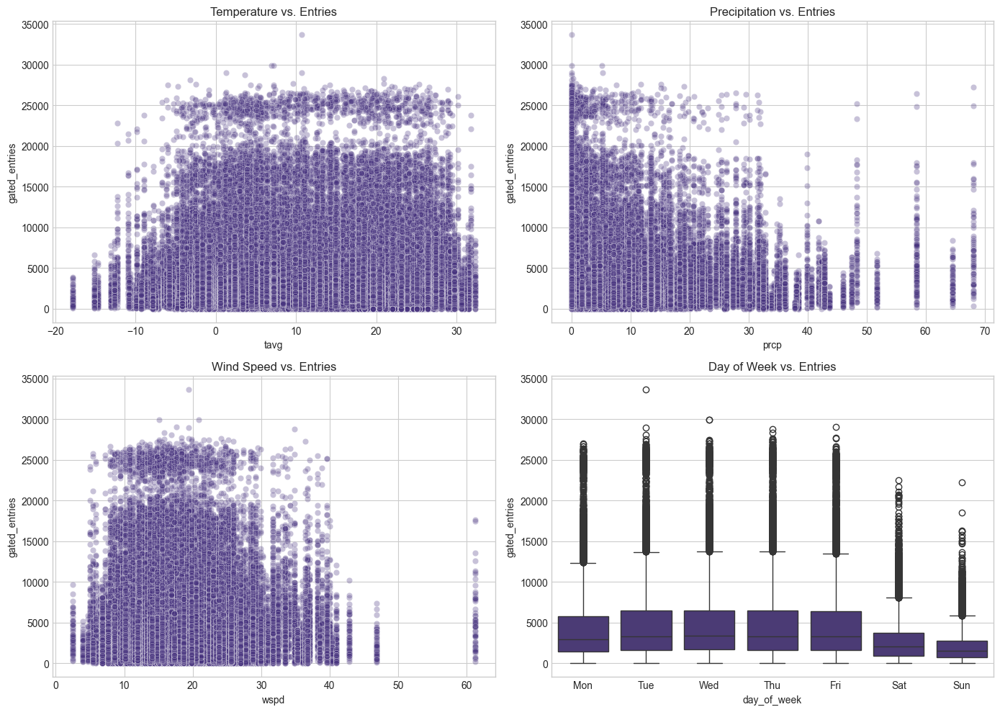
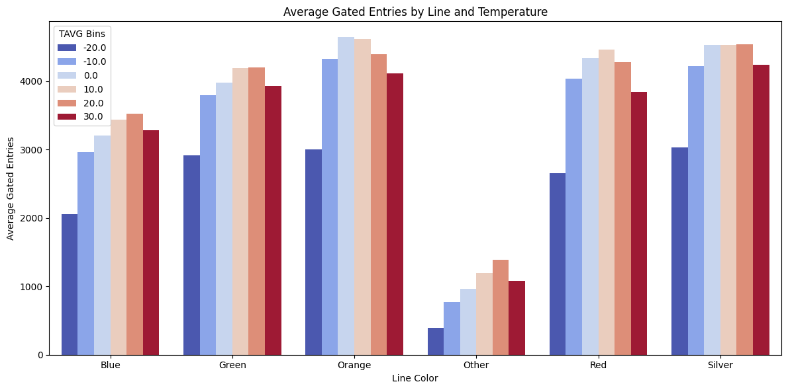
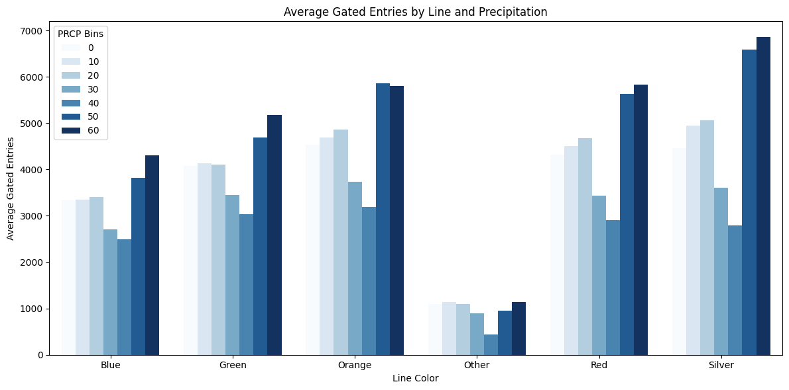
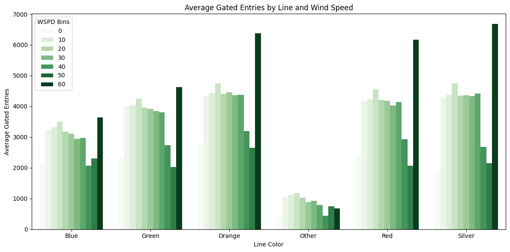

### Initial insights

- Both precipitation and wind speed show a non-linear effect on ridership.
- Light to moderate weather has minimal impact, while harsh conditions (40mm+ rain or 40+ WSPD) lead to a drop in ridership.
- During extreme weather (60mm+ rain or 60 WSPD), more people use the T, likely due to unsafe road conditions for cars.
- Temperature also plays a role—stations near recreational areas experience higher ridership in warm weather, likely due to seasonal visits.

### Correlation Between Precipitation, Wind Speed, and Temperature on T Station Entries

By analyzing the graphs of precipitation (prcp bins) and wind speed (WSPD bins) against gated entries at various T stations, a similar trend emerges:

#### 1. Moderate Weather (0-30mm Rain / 0-30 WSPD)

- Ridership remains stable despite light rain or mild winds.
- People continue commuting normally, as these conditions do not significantly impact travel.

#### 2. Heavy Rain (40mm) & Strong Winds (40 WSPD)

- A decrease in entries is observed as commuting becomes less convenient.
- Some people opt for alternative transportation (cars, remote work, delayed travel).

#### 3. Extreme Conditions (60mm Rain / 60 WSPD)

- Unlike the drop at 40mm precipitation, entries rise again at 60mm precipitation and 60 WSPD.
- This suggests that during extreme weather (storm, snowfall, or strong winds), people rely more on public transit, as driving or biking becomes unsafe.

#### 4. Seasonal Temperature Influence

- We can observe a clear curve in gated entries decreasing in certain conditions.
- However, in stations like Aquarium and Revere Beach, entries increase with higher temperatures.
- This suggests a correlation with seasonal travel patterns, where people visit more outdoor or recreational areas during summer.

## Interactive Visualizations

- heatmapvisualization.py: Creates an interactive animation showing MBTA station ridership with heat-mapped error markers on a coordinate grid, featuring a timeline slider and weather condition display for each date.

- visualization.py: Builds a similar animated scatter plot visualization (mapped onto the MBTA routes) of MBTA stations showing actual vs. predicted ridership with color-coded error indicators.

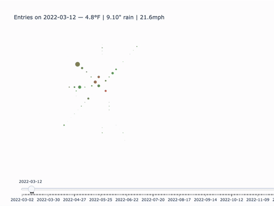
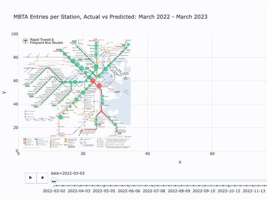

### Further Insights

- The model predicts station entries more accurately when daily entries are close to the station's average; large fluctuations lead to more errors.

- Busier stations tend to have more inaccurate predictions, likely due to unpredictable surges from events like sports games, concerts, commencements, or holidays.

- The geographic map visualization helps identify spatial patterns—errors often affect entire lines, possibly due to system-wide disruptions or the closure of connecting stations.

## Running and Setting Up The Project

To setup and run the project automatically, run this script:

```bash
./run_project.sh
```

This script will:

- set up your virtual environment
- install dependencies
- process MBTA and Weather dataset
- generate the model
- generate the visualization

## Running Tests

This project includes automated tests for both data preprocessing and model pipeline using `pytest`. These tests are located in the `tests/` directory.

### 1. Prerequisites

Ensure your environment is set up with the required dependencies:

```bash
python -m venv venv
source venv/bin/activate    # On macOS/Linux
venv\Scripts\activate       # On Windows
pip install -r requirements.txt
```

Alternatively, to run and setup the entire project, see [Running and Setting Up the Project](#running-and-setting-up-the-project) above

### 2. Tests

- **tests/test_processing.py**\
  Tests the MBTA and weather data preprocessing pipeline:

  - Unzipping raw MBTA data
  - Merging and cleaning MBTA and weather data
  - Combining both datasets

- **tests/test_model_pipeline.py**\
  Tests the model pipeline end-to-end:

  - Loads the processed merged CSV
  - Runs training and evaluation on models
  - Checks whether the output CSV with predictions is created

### 3. Running Tests

To run all tests:

```bash
pytest -v tests/
```

To run a specific test file:

```bash
pytest -v tests/test_processing.py
pytest -v tests/test_model_pipeline.py
```

Make sure the following data files are in place before running the tests:

- `data/raw/yearly_mbta_data.zip`
- `data/raw/weather_data.csv`
